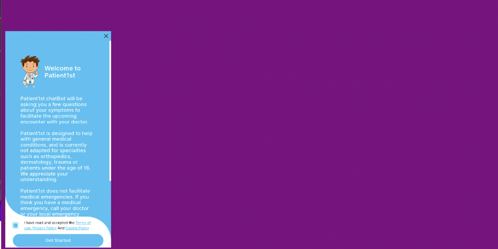
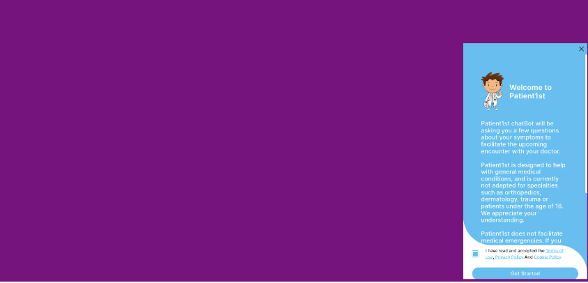
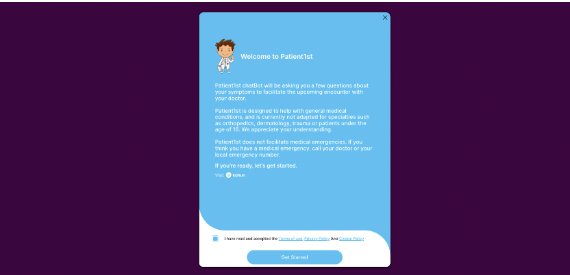
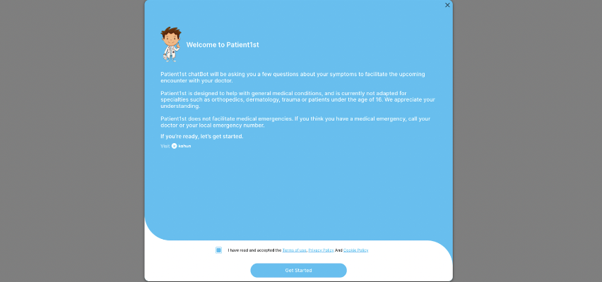

## **Partner Integration API**

## **Server REST API**

### **Overview**

Kahun provides a REST API to allow partners to integrate with the patient intake chat service. Using the API, the
partner can:

* Create a new patient interaction case record, which is given a unique ID by the system.
* Contribute clinical and demographic patient information to the case.
* Generate a unique url link which can be shared with the patient. The link launches the patient interaction session.
* Poll the system for the current status of the interaction.
* Receive a text summary of the patient interaction.
* Receive structured insights of the patient case, such as navigation advice and likely differencial diagnosis.
* Get a link which launches a provider-facing interactive Patient Card which contains all information and insights from
  the interaction.

_The REST API is intended to be used for server-to-server communication, and not directly from a web-browser.
To interact with Kahun in a client-side context, e.g. from a webpage on your system, please see the Web Browser SDK section_

### **Postman Collection**
Postman (postman.com) is a free tool for testing APIs. We provide a Postman collection which you can import to try out the API described in this document and see working examples.  
Remember to configure the collection and add your provided CLINIC_ID and API_KEY to the Variables Section.

<a href="./postman_collection.json" download>Download Postman Collection</a>


### **API Key**

In order to use the API, you will be provided an API key which should be passed as a header on all HTTPS POST requests
to the API. \
The format of the header is:

<table>
  <tr>
   <td>x-api-key
   </td>
   <td>provided api key
   </td>
  </tr>
</table>

### **Clinic Key**

Patient sessions created through the API should be associated with a provided ‘Kahun Clinic ID’. This provides a means
to customize and manage interaction settings using the clinic section of the Kahun Website, and enables Kahun to
customize settings for a particular use case.

To associate the sessions with a clinic, send the clinic-ID using a header on all HTTPS POST requests to the API.

The format of the header is:


<table>
  <tr>
   <td>x-kahun-clinic-id</td>
   <td>provided clinic ID</td>
  </tr>
</table>

### **Create New Patient Interaction Case Record**

A case record represents a specific intake interaction between a patient and the Kahun chat system. Once the case record
is created, the patient can initiate the chat at any future point

URL:  [https://api.kahun.com/cases](https://api.kahun.com/cases)

Method: POST

#### Headers:

<table>
  <tr>
   <td>x-api-key
   </td>
   <td>provided api key
   </td>
  </tr>
  <tr>
   <td>x-kahun-clinic-id
   </td>
   <td>clinic Id from clinic management page
   </td>
  </tr>
  <tr>
   <td>content-type
   </td>
   <td>application/json
   </td>
  </tr>
</table>

#### Body:

Kahun supports the following:

* **An empty JSON object**
   ```json
    {}
  ```

This will create a case record with no initial patient information.

* **Initial clinical and demographic data.**  \
  The supported format for clinical data is a JSON formatted object. The format specification matches the Athena Health
  API (see _[https://docs.athenahealth.com/api/docs/charts](https://docs.athenahealth.com/api/docs/charts)_), but is
  general enough to be created from a variety of source data.

Example:

```json
{
  "caseFormat": "athena",
  "case": {
    "demographics": {
      "age": 54,
      "gender": "M"
    },
    "problems": [
      {
        "lastmodifieddatetime": "2021-04-14T02:19:14-04:00",
        "name": "Renal disorder",
        "codeset": "SNOMED",
        "code": "420279001"
      }
    ]
  }
} 
```

* **Text Overrides** \
  Each request can also have a overrides object, which enables to customize texts shown in the Patient1st application. You can customize text using plain text or html formatted text.\
  \
  To use html formatting, your entire content should be enclosed in a valid html tag (for example, a `<div>` tag).

```json
{
  "overrides": {
    "WELCOME_PATIENT": "Welcome text appearing at top of cover page",
    "WELCOME_PARTNERS":  "Main text of welcome cover page",
    "THANK_YOU_PATIENT": "Customized thank you text",
    "THANKS_SUB_TITLE": "Additional thank you page content"
  }
}
```

These are the supported custom fields:
<table>
  <tr>
   <td><em>FIELD</em>
   </td>
   <td><em>DESCRIPTION</em>
   </td>
  </tr>
  <tr>
   <td>WELCOME_PATIENT
   </td>
   <td>Text that the patient will see in the Patient1st welcome screen 
   </td>
  </tr>
  <tr>
   <td>THANK_YOU_PATIENT
   </td>
   <td>Text that the patient will see in the Patient1st Thank you screen 
   </td>
  </tr>
</table>

#### Response

The response is a JSON document with the following properties. All values below are of type string.

<table>
  <tr>
   <td><em>FIELD</em>
   </td>
   <td><em>DESCRIPTION</em>
   </td>
  </tr>
  <tr>
   <td>patient
   </td>
   <td>A URL link for the patient of Kahun’s Patient1st application. This link can be shared with the patient.
   </td>
  </tr>
  <tr>
   <td>provider
   </td>
   <td>A URL link for the physician which displays the Patient Card web interface. The Patient Card displays the summary and Kahun’s insights relating to the patient background and present findings. 
   </td>
  </tr>
  <tr>
   <td>status
   </td>
   <td>A URL link to a JSON document providing the current status of the interaction. This link can be periodically polled to receive updated status.
   </td>
  </tr>
  <tr>
   <td>summary
   </td>
   <td>A URL link to a JSON document representing a textual summary for the patient case.
   </td>
  </tr>
  <tr>
   <td>widgetSettings
   </td>
   <td>Attributes which can be passed to the front-end widget in order to initialize the patient-facing application (see Widget section below).
   </td>
  </tr>
  <tr>
   <td>caseId
   </td>
   <td>The unique ID for this case record
   </td>
  </tr>
  <tr>
   <td>pdf
   </td>
   <td>A URL link which downloads a pdf document with a formatted version of the summary information
   </td>
  </tr>
</table>

### **Retrieving the Case Summary**

The summary is retrieved from the ‘summary’ link, which is returned when the case record is created. The summary
contains a textual description of the case, as well as structured information generated from Kahun’s clinical reasoning
engine.

The summary can be used to copy Kahun’s output to an external system, for example, as a case note to an EHR system.

Here is the basic structure of the summary JSON document <a id="summary-format"></a>

```json
{
  "patientSummary": {
    "data": {
      "age": "<number>",
      "gender": "<Female | Male>",
      "main": "<Chief Complaint>",
      "sections": [
        {
          "title": "<section title>",
          "content": "<section text content>",
          "type": "<one of: assessment|dd|hpi|imaging|labs|pe|plan|referral|ros|suggested|triage_advice>"
        }
      ]
    }
  },
  "status": "<CREATED | IN_PROGRESS | COMPLETED | ABANDONED>",
  "mostLikelyCauses": [
    {
      "snomedid": "<snomed code>",
      "name": "<name of disease>",
      "strength": "<0-1 indicating strength of evidence>"
    }
  ],
  "lessLikelyCauses": [
    {
      "snomedid": "<snomed code>",
      "name": "<name of disease>",
      "strength": "<0-1 indicating strength of evidence>"
    }
  ],
  "navigationAdvice": {
    "level": "<number between 1-10, where 1 is the highest level of urgency>",
    "title": "<title of navigation advice>",
    "description": "<description>"
  }
}
```

Here is an example of a summary section:

```json
{
  "patientSummary": {
    "data": {
      "age": 23,
      "gender": "Female",
      "main": "Fever",
      "sections": [
        {
          "content": "Female, 23 years old, recently gave birth, presenting with fever between 100.5°F (38.1°C) and 104.0°F (40°C) for a duration of one day to one week. Patient describes the fever as intermittent.\n\nPatient has medical history of: Neurofibroma, inflammatory pseudotumor of orbit, atrial fibrillation, prediabetes and angioedema.",
          "title": "History of present illness",
          "type": "hpi"
        },
        {
          "content": "The patient is also suffering from cough (duration one day to one week and character productive), headache (location frontal region, temporal region, severity moderate and duration one day to one week) and dysphagia (duration one day to one week).\n\nThe patient denies: sneezing, difficulty breathing, diaphoresis, sore throat, chills, fatigue, disordered taste, nasal congestion, loss of appetite, muscle pain and loss of sense of smell.\n",
          "title": "Review of systems",
          "type": "ros"
        },
        {
          "content": "Patient presenting for evaluation of fever. Patient has associated symptoms of cough, headache and dysphagia.\n\nDiagnosis is most consistent with pneumonia.\n\nOther possible causes to be considered include sinusitis and bronchitis. \n\n",
          "title": "Assessment",
          "type": "assessment"
        }
      ]
    }
  },
  "status": "COMPLETED"
}
```
#### Navigation Advice
The navigation advice is included, when available, as part of the summary JSON response. The navigation advice includes the following fields.

| <em>FIELD</em> | <em>DESCRIPTION</em>                                                                  |
|----------------|---------------------------------------------------------------------------------------|
| title          | The call to action for this navigation                                                |
| description    | A more detailed explanatory text                                                      |
| level          | A number from 1-10 indicating the urgency of the navigation, where 1 is most emergent |
| id             | An id string which uniquely identifies this navigation advice                         |

##### Navigation Advice Levels
Several variants of navigation advice will have the same numeric level, if they represent approximately the same level of urgency, or the same time frame for seeking care.
Note that additional navigation advice verbiage may be added in the future, so it is best to rely on the *level* field for any programmatic action.

| <em>Level</em> | <em>Navigation Advice</em>                   |
|----------------|----------------------------------------------|
| 1              | Call EMS 911 Now                             |
| 2              | Go to ED Now                                 |
| 2              | Go to L&D Now                                |
| 3              | Go to ED Now (or PCP triage)                 |
| 3              | Go to L&D Now (or PCP triage)                |
| 4              | Office or Video visit now                    |
| 5              | Callback or video visit by PCP within 1 hour |
| 6              | Office or Video visit today                  |
| 6              | Callback or video visit by PCP today         |
| 7              | Office or Video visit within 24 Hours        |
| 7              | Office or Video visit today/tomorrow         |
| 8              | Office or Video visit in 3 days              |
| 9              | Office or Video visit within 2 Weeks         |
| 10             | Home Care                                    |


### **Retrieving the status of the case record**

The status is retrieved from the ‘status’ link, which is returned when the case record is created.

The status link can be periodically polled and will return the current state of the record. In addition it will return
current links, as in the original response.

The status is a JSON document:

```json
{
  "status": "CREATED",  // "IN_PROGRESS" | "COMPLETED" | "ABANDONED",
  "questionsCount": 28,
  "conversationProgress": 100
}
```

<table>
  <tr>
   <td><em>FIELD</em>
   </td>
   <td><em>TYPE</em>
   </td>
   <td><em>DESCRIPTION</em>
   </td>
  </tr>
  <tr>
   <td>status
   </td>
   <td>string
   </td>
   <td>CREATED: Case was created. Patient did not answer a question yet.
<p>
IN_PROGRESS: Patient answered at least one question but did not complete the conversation.
<p>
COMPLETED: Patient completed the conversation. 
   </td>
  </tr>
  <tr>
   <td>questionCount
   </td>
   <td>number
   </td>
   <td>The number of questions the patient answered. 
   </td>
  </tr>
  <tr>
   <td>conversationProgress
   </td>
   <td>number
   </td>
   <td>An approximate progress in percentage. This is a heuristic measure of the percentage of the clinical intake process that has been completed 
   </td>
  </tr>
</table>

## Webhook Integration

Using the webhook integration, you can receive asynchronous notifications to your system when the status of any
previously-created case record changes, and receive the summary information for a case record when it is available.

Using the webhook allows you to create a single point to process all incoming information across all cases from a single
Kahun Clinic ID.

### **Limitations**

Only one webhook can be defined per Kahun Clinic ID.

The Kahun system will retry delivery of notifications only a limited number of times. To use webhook integration, you
must provide a service with enough capacity for the expected rate of notifications.

_Currently, webhook integration requires setup via Kahun support._

### **HTTPS Protocol**

Notifications are delivered using HTTPS POST to a publicly accessible URL provided during setup of the webhook
The body of the post will be in JSON format as described below

### **Message Body Format**

Each message may contain one or more separate notification messages, and will be wrapped in a JSON array field called
“notifications”

```json
{
  "clinicId": "<originating clinic id>",
  "jwtSignature": "<string>",
  "notifications": [
    "<notifcation1>,<notifcation2>"
  ]
} 
```

#### Notification Format

Each individual notification indicates a change of status of a single case record

```json
{
  "caseId": "<case recordid>",
  "time": "<a timestamp string>",
  "status": "<string>",
  "conversationProgress": "<number>",
  "patientSummary": "<summary data  object>"
}
```

For detailed descriptions of the data fields, please see the previous sections
[Retrieving the status of the case record](#retrieving-the-status-of-the-case-record)
[Retrieving the Textual Case Summary](#retrieving-the-case-summary)

The _status_, _conversationProgress_, and _patientSummary_ fields use the same format as the corresponding fields in the
REST API.

<table>
  <tr>
   <td><em>FIELD</em>
   </td>
   <td><em>DESCRIPTION</em>
   </td>
  </tr>
  <tr>
   <td>caseId
   </td>
   <td>The unique case record id which was returned when the case record was created.
   </td>
  </tr>
  <tr>
   <td>time
   </td>
   <td>The time of the status change
   </td>
  </tr>
</table>

##### Patient Summary

The patient summary is only included in the notification when the status has changed to either COMPLETED or ABANDONED.

## Web Browser SDK

The web-browser sdk allows a partner to integrate Kahun functionality with web pages hosted in their environment

Using the SDK, you can do the following within your web site:
* Create a new case record, and populate it with existing patient information
* Host the Kahun Chatbot as a widget running within your own website
* Retrieve case insights such as text summary, navigation advice, and likely diagnosis directly to the web page. 


### SDK Script Tag

To use the SDK on a webpage, include the Kahun script tag within the `head` tag of the page.
The source url for the script should be:
```html
https://patient.kahun.com/api/clientapi.js
```
It is recommended to use the `async` or `defer` attribute so that tag loading will not affect page performance.

Optionally,  use the `onload` attribute of the script tag to set a custom javascript function that will run when the library has been loaded. This is a good place for code that should interact with the SDK as soon as the page loads.  

Example
```html
<head>
<script>
    function onKahunLoaded() {
        //... ok to interact with the kahun sdk here
    }
</script>    
<script src="https://patient.kahun.com/api/clientapi.js" onload="onKahunLoaded()" async></script>
</head>
```
##### Before you begin integration

Coordinate with Kahun staff the domain(s) which are going to host the script tag. The Kahun backend must be configured with your domain details to prevent CORS errors when using Kahun code on your website.


### Obtaining a Case Record
 
You will normally first create a case record object, which represents a particular patient case record in Kahun's system, this object provides access to all functionality relating to that patient case. 

#### Creating a new case record

**New Case Record**
```typescript
interface NewCaseParams {
    apiKey: string; // the APIKEY provided to you
    clinicId: string; // the CLINIC_ID provided to you
    clinicalData?: object; // optionally, background data about the patient 
}
declare namespace Kahun {
    function newCaseRecord(params: NewCaseParams): Promise<CaseRecord>
}
```
**`Kahun.newCaseRecord({...params})`**
Use to create a new case record which will be assigned a unique id in the Kahun system.


| <em>Parameter</em>    | <em>Description</em> |    
|--------------|-------------------------------|
| apiKey       | The api key provided to you   |
| clinicId     | The provided clinic id        |      
| clinicalData | Optional. Use this to prepopulate information about the patient.<br>  See the [Initial clinical and demographic data](#Initial clinical and demographic data) section for a description of this format.|

Returns a promise which will resolve to the CaseRecord object for the newly created case.

**Example**
```javascript
    var kahunCaseRecord;
    kahunCaseRecord = await Kahun.newCaseRecord({
       apiKey: "<provided api key>",
       clinicId: "<provided clinic id",
       clinicalData: {
           "caseFormat": "athena",
           "case": {
               "demographics": {
                   "age": 54,
                   "gender": "M"
               },
           }
       }
    });
    console.log("The new case id is", kahunCaseRecord.getCaseId())
```

#### Accessing an existing case record

**Existing Case Record**

```typescript
interface ExistingCaseParams {
    apiKey: string; // the APIKEY provided to you
    clinicId: string; // the CLINIC_ID provided to you
    caseId: string; // the case id to use 
}
declare namespace Kahun {
    function existingCaseRecord(params: ExistingCaseParams): Promise<CaseRecord>
}
```
**`Kahun.existingCaseRecord({...params})`**

Use to perform operations or get information using an existing case id. 


For example, the case record may have been created through the server-to-server flow, or perhaps through a different web page, and has been passed to this page.


| <em>Parameter</em> | <em>Description</em>        |    
|--------------------|-----------------------------|
| apiKey             | The api key provided to you |
| clinicId           | The provided clinic id      |      
| caseId             | The existing case id        |

**Example**
```javascript
    var kahunCaseRecord;
    kahunCaseRecord = await Kahun.existingCaseRecord({
       apiKey: "<provided api key>",
       clinicId: "<provided clinic id>",
       caseId: "<previously created case id>"
    });
    console.log("The status of this case is", kahunCaseRecord.getStatus())

```

### Case Record Object
```typescript
interface CaseRecord {
  getCaseId(): string; // the id of the case
  getLinks(): Record<string, string>; // get urls for summary,pdf,patient,and provider web resources
  getStatus(): "ABANDONED" | "COMPLETED" | "IN_PROGRESS" | "CREATED";  
  generateSummary(): Promise<object>; // generate and receive summary output
  startChatBotWidget(settings?: WidgetSettings): Promise<boolean>; // launch the chatbot as a page widget
  removeChatBotWidget(): void; // remove the chatbot widget from the page
  on(name: string, cb: any); // register for events
  removeListener(name: string, cb: any); //  unregister for events
}
```
The CaseRecord object is returned when creating a new case, or accessing an existing case. This provides the main API for functionality relating to the case.

#### getCaseId

Returns the unique id for the case.

#### getLinks

Returns an object containing urls to various web services.
<table>
  <tr>
   <td><em>FIELD</em>
   </td>
   <td><em>DESCRIPTION</em>
   </td>
  </tr>
  <tr>
   <td>patient
   </td>
   <td>A URL link for the patient of Kahun’s Patient1st application. This link can be shared with the patient.
   </td>
  </tr>
  <tr>
   <td>provider
   </td>
   <td>A URL link for the physician which displays the Patient Card web interface. The Patient Card displays the summary and Kahun’s insights relating to the patient background and present findings. 
   </td>
  </tr>
  <tr>
   <td>summary
   </td>
   <td>A URL link to a JSON document representing a textual summary for the patient case.
   </td>
  </tr>
  <tr>
   <td>pdf
   </td>
   <td>A URL link which downloads a pdf document with a formatted version of the summary information
   </td>
  </tr>
</table>

#### getStatus
Returns the current status of the interaction.

#### generateSummary
Returns a promise which resolves to the _Summary Output Document_. This JSON object contains the textual summary, navigation advice, and differencial diagnosis.
It is best to wait until the case is no longer in progress (status will be either "COMPLETED" or "ABANDONED") before generating the summary.

The format of the returned object is the same as for the REST API. See [Summary Resource](#summary-format)

### ChatBot Widget

Kahun’s chatbot can be run as an integrated HTML element embedded in your page. The chatbot is launched and controlled using the CaseRecord API

Note: You do not have to integrate the chat bot in your own website. Kahun's chatbot also runs as a standalone responsive web app which is designed to be usable on a wide range of devices both
desktop and mobile. To launch the standalone application, launch the url which is provided under the _patient_ property returned when the case record was created, or returned from the `kahunCaseRecord.getLinks()` API call.


#### **HTML Integration**

In order to integrate a widget-like element in your HTML page, take the following steps:

##### Div Tag

1. Include the Kahun script tag as descibed above.

### Case Record Object
```typescript
interface CaseRecord {
  getCaseId(): string; // the id of the case
  getLinks(): Record<string, string>; // get urls for summary,pdf,patient,and provider web resources
  getStatus(): "ABANDONED" | "COMPLETED" | "IN_PROGRESS" | "CREATED";  
  generateSummary(): Promise<object>; // generate and receive summary output
  startChatBotWidget(settings?: WidgetSettings): Promise<boolean>; // launch the chatbot as a page widget
  removeChatBotWidget(): void; // remove the chatbot widget from the page
  on(name: string, cb: any); // register for events
  removeListener(name: string, cb: any); //  unregister for events
}
```
The CaseRecord is object is returned when creating a new case, or accessing an existing case. This provides the main API for functionality relating to the case.

#### getCaseId

Returns the unique id for the case.

#### getLinks

Returns an object containing urls to various web services.
<table>
  <tr>
   <td><em>FIELD</em>
   </td>
   <td><em>DESCRIPTION</em>
   </td>
  </tr>
  <tr>
   <td>patient
   </td>
   <td>A URL link for the patient of Kahun’s Patient1st application. This link can be shared with the patient.
   </td>
  </tr>
  <tr>
   <td>provider
   </td>
   <td>A URL link for the physician which displays the Patient Card web interface. The Patient Card displays the summary and Kahun’s insights relating to the patient background and present findings. 
   </td>
  </tr>
  <tr>
   <td>summary
   </td>
   <td>A URL link to a JSON document representing a textual summary for the patient case.
   </td>
  </tr>
  <tr>
   <td>pdf
   </td>
   <td>A URL link which downloads a pdf document with a formatted version of the summary information
   </td>
  </tr>
</table>

#### getStatus
Returns the current status of the interaction.

#### generateSummary
Returns a promise which resolves to the _Summary Output Document_. This JSON object contains the textual summary, navigation advice, and differencial diagnosis. 
It is best to wait until the case is no longer in progress (status will be either "COMPLETED" or "ABANDONED") before generating the summary. 

The format of the returned object is the same as for the REST API. See [Summary Resource](#summary-format)

### ChatBot Widget

Kahun’s chatbot can be run as an integrated HTML element embedded in your page. The chatbot is launched and controlled using the CaseRecord API

Note: You do not have to integrate the chat bot in your own website. Kahun's chatbot also runs as a standalone responsive web app which is designed to be usable on a wide range of devices both
desktop and mobile. To launch the standalone application, launch the url which is provided under the _patient_ property returned when the case record was created, or returned from the `kahunCaseRecord.getLinks()` API call. 


#### **HTML Integration**

In order to integrate a widget-like element in your HTML page, take the following steps:

##### Div Tag

1. Include the Kahun script tag as descibed above.

2. Create a div element on the page which will hold the widget.  \
   The div element should have the following id: id=”kahun-patient” . Kahun code will place the widget into the DOM
   within the div you have provided. \
   \

   The div tag is configured using html attributes below. 

```html

<div
        id="kahun-patient"
        data-window-alignment="left" (optional)
'
>
</div>
```


##### Window alignment

It is possible to load the Kahun chat in 4 different layout variations for desktop view, to do so change
the `data-window-alignment `attribute of the "kahun-patient"  container div.

**NOTE:** in mobile the chat window will always spread responsively to overlay almost the entire screen.

Here is a list of supported alignment variations:

<table>
  <tr>
   <td>Attribute value</td>
   <td>Description</td>
   <td>Screenshoot</td>
  </tr>
  <tr>
   <td>data-window-alignment="left" </td>
   <td>Window is aligned to the <strong>left</strong> side of the screen<strong> (default)</strong></td>
   <td>
    
   </td>
  </tr>
  <tr>
   <td>data-window-alignment="right" </td>
   <td>Window is aligned to the <strong>right</strong> side of the screen (default)</td>
   <td>
    
   </td>
  </tr>
  <tr>
   <td>data-window-alignment="center"</td>
   <td>The window will open in a pop-up like view the middle of the screen with a dark background over the content of the page</td>
   <td>
    
   </td>
  </tr>
  <tr>
   <td>data-window-alignment="fullscreen"</td>
   <td>This value is used for clients who wish to load the chat as a standalone app that takes over the entire content of the page.<p> NOTE: if in “fullscreen” mode the user cannot close/minimize the chat screen
   </td>
   <td>
    
</td>
  </tr>
</table>

#### Launching the Widget

**Start Chat Bot**

Use the `kahunCaseRecord.startChatBot(...)` API call to launch the widget and mount it into the DOM.

```typescript
interface WidgetSettings {
    locale: string; // the display language for chatbot
    onCompletionUrl: URL; // if provided, will redirect at end of conversation
    onAbandonUrl: URL; // if provided, will redirect when conversation ends prematurely
}

```
##### **Optional Widget Settings**
A settings object can be passed to the `kahunCaseRecord.startChatBot(...)`  call to control behavior of the chat bot. All settings are optional.

<table>
  <tr>
   <td><em>FIELD NAME</em>
   </td>
   <td><em>TYPE</em>
   </td>
   <td><em>DESCRIPTION</em>
   </td>
   <td><em>SUPPORTED VALUES </em>
   </td>
  </tr>
  <tr>
   <td>locale
   </td>
   <td>string
   </td>
   <td>In what display language the app should run
   </td>
   <td>
“en” - English (default)
“he” - Hebrew
“fr” - French
“pt” -  Portuguese
“es” - Spanish  
   </td>
  </tr>
  <tr>
   <td>utmString (optional) 
   </td>
   <td>URL encoded UTM code
   </td>
   <td>Used when navigation out of the widget to a partner page, these utm params will be appended to the URL
   </td>
   <td>
   </td>
  </tr>
  <tr>
   <td>onCompletionUrl
   </td>
   <td>URL
   </td>
   <td>If provided the widget will redirect to this url at the end of the conversation. 
   </td>
   <td>
   </td>
  </tr>
  <tr>
   <td>onAbandonUrl
   </td>
   <td>URL
   </td>
   <td>If provided the widget will redirect to this url when user abandoned the conversation 
   </td>
   <td>
   </td>
  </tr>
</table>

#### Closing the Widget

**Remove Chat Bot Widget**

To programmatically close the widget and remove it from the page, use `kahunCaseRecord.removeChatBotWidget()`
If the widget is not currently open this will have no effect

#### Responding to Events

The widget emits events which can be sent to code on the page.

To register a listener function to receive events use: `kahunCaseRecord.on(event-name, listener)`

To unregister use: `kahunCaseRecord.removeListener(event-name, listener)`

Example:
```javascript
kahunCaseRecord.on("done", (evt) => {
    console.log("user has completed the chat");
})
```


<table>
  <tr>
   <td><em>Event</em>
   </td>
   <td><em>Description</em>
   </td>
   <td><em>Sample Payload</em>
   </td>
  </tr>
  <tr>
   <td>
    <h7>widget_state</h7>
   </td>
   <td>Reports on whether the widget <em>interface</em> is open or close
   </td>
   <td>
<code>
{ 
 "type":"widget_state",
 "state": "open", 
  "status": "IN_PROGRESS" 
}</code>
   </td>
  </tr>
  <tr>
   <td>
<h7>status</h7>
   </td>
   <td>Reports on progress of the interactive chat session
   </td>
   <td><code>{ 
  "type": "status", 
  "progress": 80, 
  "status":  "IN_PROGRESS" 
}</code>
   </td>
  </tr>
  <tr>
   <td>
<h7>done</h7>
   </td>
   <td>Issued when chat bot is finished, whether the chat is completed, or was abandoned or skipped.
   </td>
   <td><code>{ 
  "type": "done", 
  "progress": 80, 
  "status":  "COMPLETED" 
}</code>
   </td>
  </tr>
</table>


#### **CSS Customization**

We've added CSS classes to have better support in changing the layout from outside the app.

##### kahun-container

The highest CSS class is _.kahun-container,_ in order to change the entire area where the widget is rendered you may
use _.kahun-container_

For example, to make the widget look properly placed in the page you may append this css rule to your HTML page:

```css
patient .kahun-container {
    left: 0;
    bottom: 40px;
    position: fixed;
    z-index: 1500;
}
```

##### open-kahun-icon

Another CSS class added is _.open-kahun-icon_ which wraps the round icon that opens the chat, so the following rule can
be added to alter the “open” button location

```css
#kahun-patient .open-kahun-icon {
    right: auto;
    left: 15%;
}
```
### Sample Client Code
Here is a complete example which you can fork or copy, implementing a custom button, and widget initialization showing
integration with the API:

[https://codepen.io/kahunapi/pen/oNqBRZp](https://codepen.io/kahunapi/pen/rNJdvPq)

